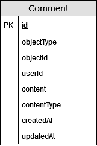

# API

## Функции (эндпониты)

1. CRUDS (create, read, update, delete, search) для комментариев (comments)

## Описание сущности comments

1. id - идентификатор коментария
2. objectType - тип сущности к которой относится комментарий
3. objectId - идентификатор сущности к которой относится комментарий
4. userId - идентификатор пользователя
5. content - содержание комментария
6. contentType - тип содержания

